# **TryHackMe Network Challenge: Breaching AD**

**Author:** StillMarzz(Sl1M)  
**Platform:** TryHackMe
**Category:** Exploiting Active Directory  
**Date:** 2/23/2025

---

## **1. Introduction**

This CTF walkthrough demonstrates various authentication-based attacks in an Active Directory environment, highlighting weaknesses in **NTLM authentication, password spraying, LDAP pass-back attacks, and credential extraction from PXE boot images and databases**.

The simulated environment consists of:
- **Domain Controller** (`THMDC - 10.200.80.101`)
- **Web Server** (`THM IIS - 10.200.80.201`)
- **PXE Boot Server** (`THM MDT - 10.200.80.202`)
- **Attacking System** (Kali/Linux machine)

Network Diagram Provided to us:

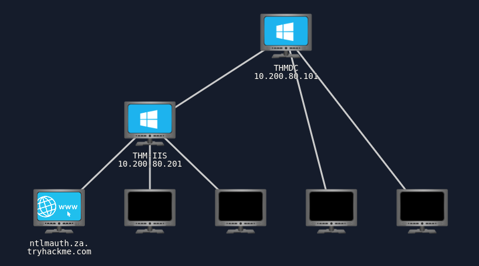  

### **Objectives**
✅ Enumerate NTLM authentication mechanisms  
✅ Exploit weak credentials via password spraying  
✅ Capture NTLM authentication hashes via LDAP attacks  
✅ Extract stored credentials from PXE boot images  
✅ Analyze sensitive credentials in the McAfee database  

---

## **2. Reconnaissance & Initial Access**

The first step was verifying if the **targeted domain name resolution** was correctly set. We configured our DNS settings to use the domain controller (`10.200.80.101`).

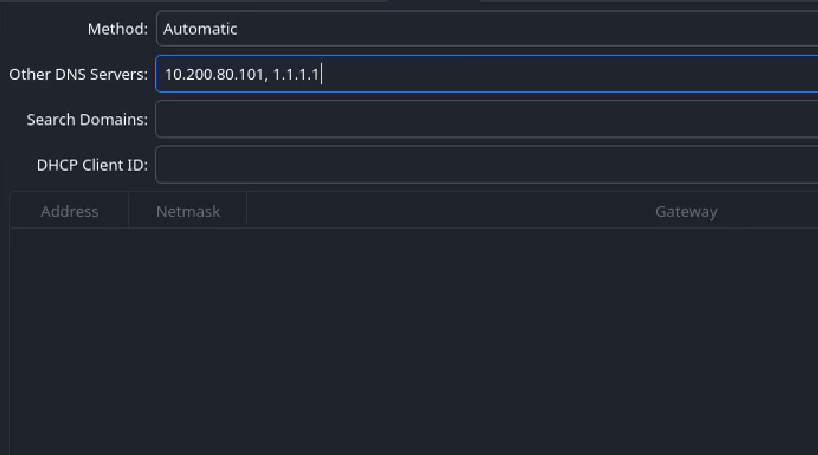  

Once configured, an **nslookup query** was performed to validate DNS resolution.

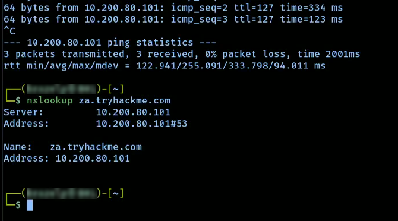  

**Q1: What popular website can be used to verify if your email address or password has ever been exposed in a publicly disclosed data breach?**
📝 **Answer:** `haveibeenpwned`

---

## **3. Password Spraying Attack**

To identify weak credentials, we attempted a **password spraying attack** against NTLM authentication.

**Q2: What is the name of the challenge-response authentication mechanism that uses NTLM?**
📝 **Answer:** `netntlm`

We found that the NTLM auth requested a username and password
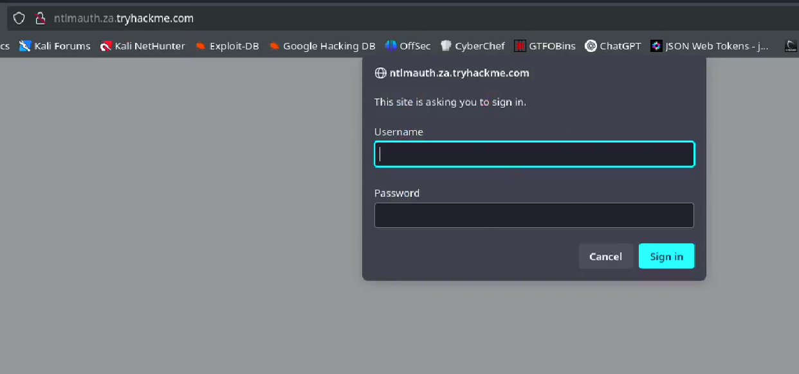  

Using an **NTLM password spraying script**, we tested a default password (`Changeme123`) against a list of known usernames.

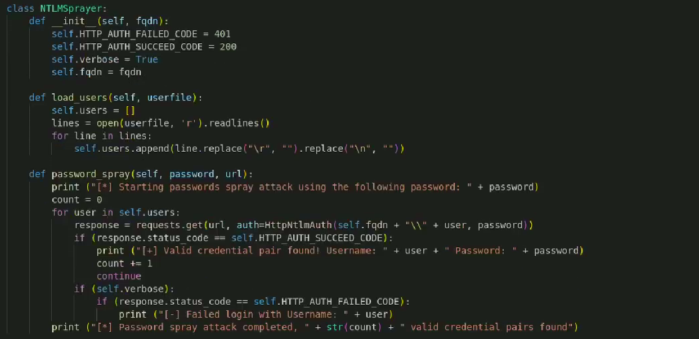  
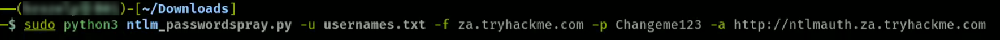   

The attack was **successful**, revealing **four valid credential pairs**:
- **Third Valid Username:** `gordon.stevens`
- **Total Valid Credentials Found:** `4`

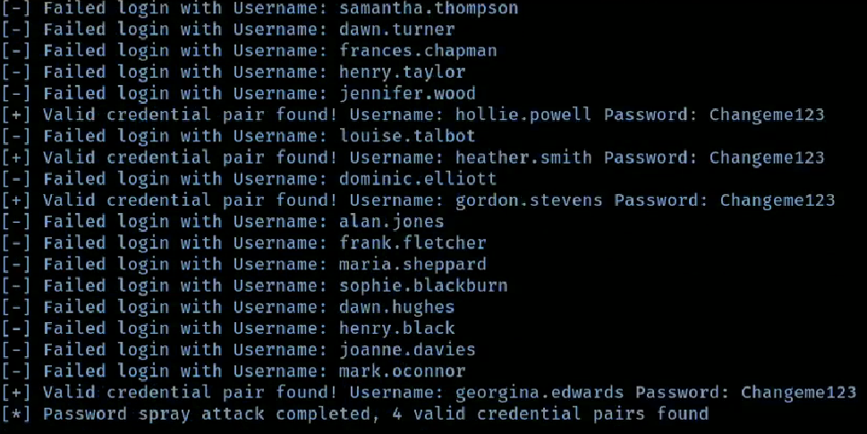  

Testing one of the compromised accounts on the **NTLM-secured web application** displayed the following response:

**Q5: What is the message displayed by the web application when authenticating with a valid credential pair?**
📝 **Answer:** `Hello World`

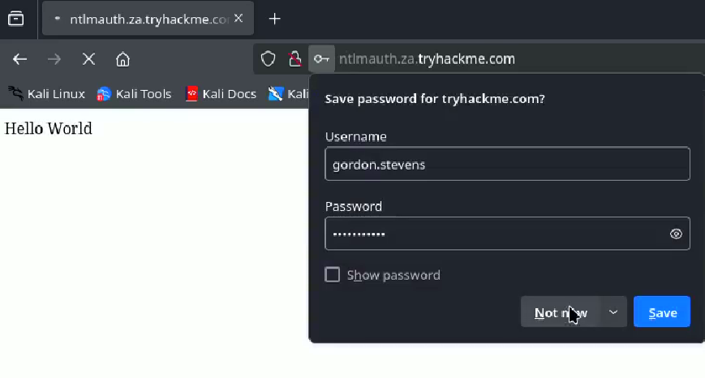  

---

## **4. LDAP Pass-Back Attack**

We found a printer settings page at printer.za.tryhackme.com/settings, which sends information to a server:

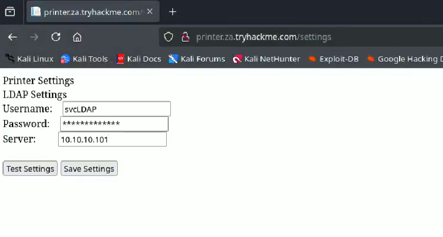  

We try to intercept using a **Netcat Listener** and changing the server information to our IP but only receive encrypted credentials:

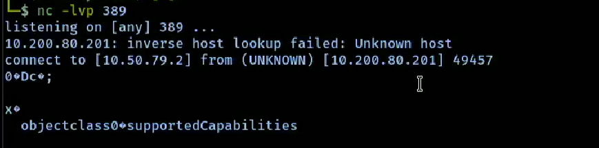  

Next, we targeted **LDAP authentication vulnerabilities** by setting up a **rogue LDAP server** to capture plaintext credentials.

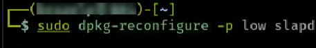  
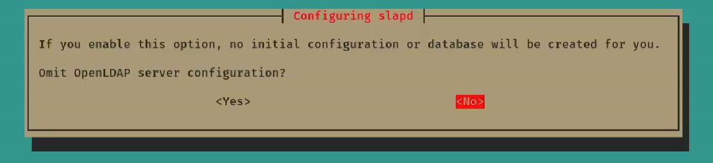  

Then, we adjusted the olcSaslSecProps.ldif to use plaintext credentials.

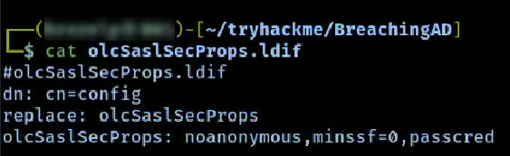  
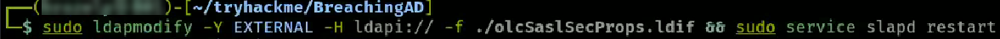 
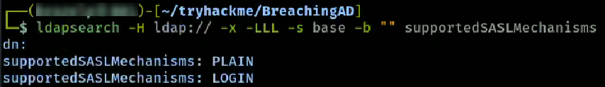

Then, we set up a tcpdump to listen for the credentials:

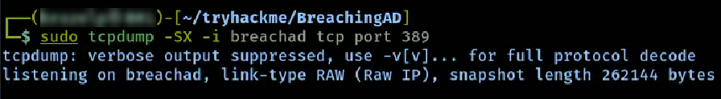  

**Q6: What type of attack can be performed against LDAP Authentication systems not commonly found against Windows Authentication systems?**
📝 **Answer:** `ldap pass-back attack`

We allowed **`login` and `plain` authentication mechanisms** to force unencrypted logins.

Captured credentials:
- **Username:** `svcLDAP`
- **Password:** `tryhackmeldappass1@`

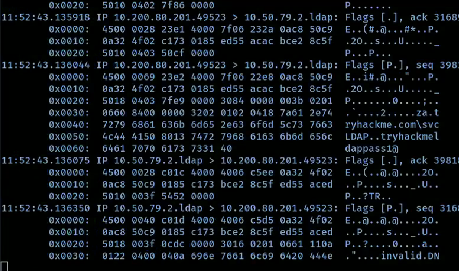  

---

## **5. NTLM Authentication Poisoning**

To capture **NTLM authentication hashes**, we deployed **Responder**.

**Q9: What is the name of the tool we can use to poison and capture authentication requests on the network?**
📝 **Answer:** `responder`

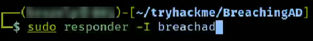  

Captured credentials (Didn't get the original screenshot):

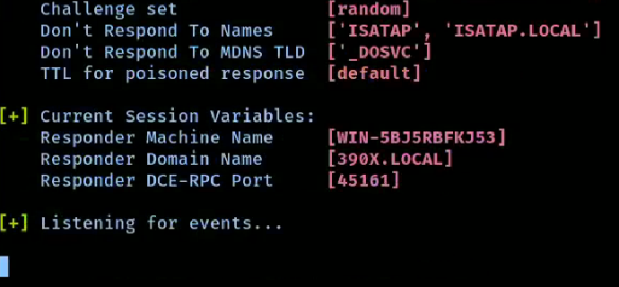
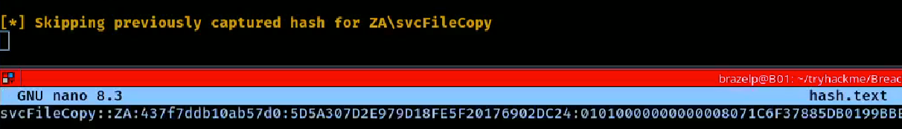

Then, using hashcat, we decrypted the user credentials:

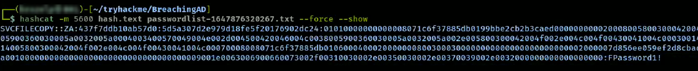

- **Username:** `svcFileCopy`
- **Cracked Password:** `FPassword1!`

---

## **6. PXE Boot Image Credential Extraction**

We would normally receive the IP for the MDT server via DHCP, but since it's provided in the network diagram, we already have it:

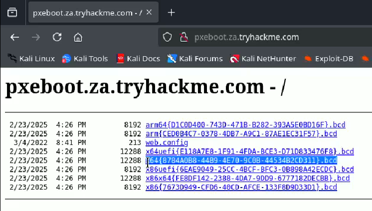  

We then ssh into the thmjmp1 machine using the password **Password1@**

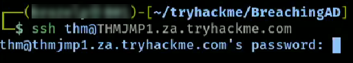  

From there, we create a directory for ourselves and copy over the PowerPXE script:

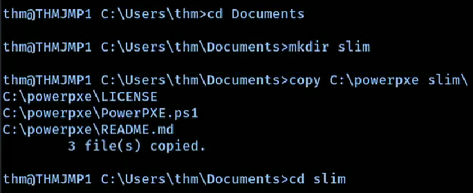  

Then, referencing the x64 file, we noticed in the browser, we copy that into our new directory:

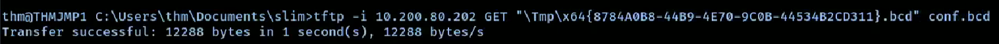  

Now, we can easily find the path to the MDT image file, copy it to our directory using tftp, and extract any credentials.

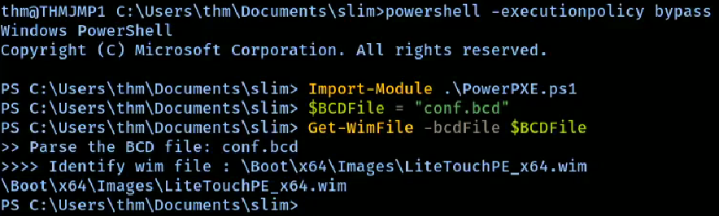  
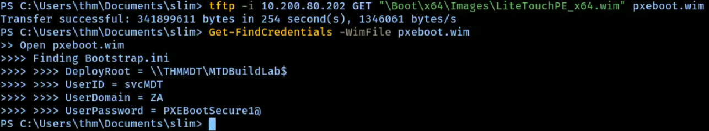  

Using **TFTP**, we retrieved PXE Boot configuration files to extract credentials.

**Q12: What Microsoft tool is used to create and host PXE Boot images in organisations?**
📝 **Answer:** `Microsoft Deployment Toolkit`

**Q13: What network protocol is used for recovery of files from the MDT server?**
📝 **Answer:** `TFTP`

Extracted credentials:
- **Username:** `svcMDT`
- **Password:** `PXEBootSecure1@`  

---

## **7. Configuration File Credential Extraction**

Upon enumerating the file system, we found a McAfee **`ma.db`** database and using scp, downloaded it to our machine.

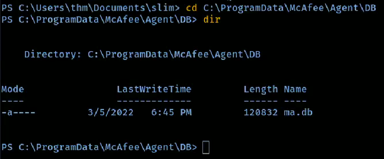  
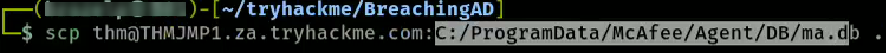

We then used an sqlitebrowser to enumerate the database and found credentials stored in the **AGENT_REPOSITORIES** database

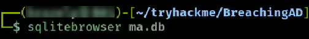
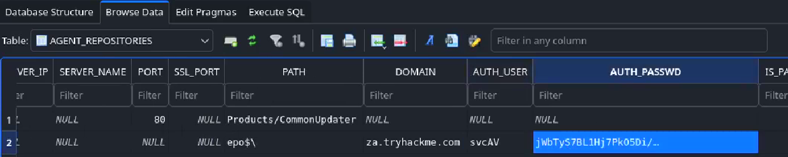

We then decrypted **AUTH_PASSWD** using a python script found at: :

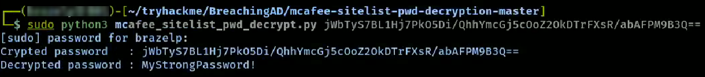

**Q18: What table in this database stores the credentials of the orchestrator?**
📝 **Answer:** `AGENT_REPOSITORIES`

- **Username:** `svcAV`
- **Password:** `MyStrongPassword!` 

---

## **8. Conclusion & Lessons Learned**

### **Key Findings:**
- Weak passwords enabled **password spraying attacks**.
- **LDAP authentication** was vulnerable to **pass-back attacks**, exposing plaintext credentials.
- **NTLM authentication poisoning** allowed **credential interception and cracking**.
- **PXE boot images stored credentials**.
- **McAfee database contained stored credentials**, which were easily decrypted.

### **Mitigation Strategies:**
✅ Enforce strong passwords & eliminate default credentials  
✅ Disable NTLM authentication where possible  
✅ Enforce LDAP signing & channel binding  
✅ Restrict access to PXE boot files and encrypt stored credentials  
✅ Secure configuration files by hashing and salting stored passwords  

🚀 **TryHackMe link to challenge: **
