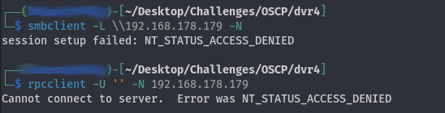

## Initial Enumeration

Performed a comprehensive port scan to identify open services:

```bash
nmap -sCV -T4 -p- $IP -oN enu/nmap-services.md
```


**Notable Services:**

- SSH (Port 22)  
- SMB (Port 445)  
- HTTP Proxy (Port 8080)  
- RPC (Port 135)

---

### SMB and RPC Null Sessions

Attempted to establish null sessions with SMB and RPC services:



---

### HTTP Enumeration

Navigated to the web service running on port 8080 and encountered the Argus Surveillance dashboard:


Initiated a directory search alongside manual exploration:

```bash
dirsearch -u http://$IP:8080
```

---

## Initial Foothold

Identified several accessible directories:

- /about.html  
- /options.html  
- /stats.html  
- /users.html

On the /users.html page, functionalities to add users, change access levels, and update passwords were available but lacked immediate utility. Proceeded to further enumeration.

Utilized `searchsploit` to identify potential vulnerabilities associated with the Argus Surveillance software:


A directory traversal vulnerability was particularly noteworthy:


Considering the open SSH port and the user `viewer` found on the web interface, attempted to retrieve SSH keys using the vulnerability:


Successfully obtained the private SSH key and established a shell:


---

## Privilege Escalation

Checked current user privileges and group memberships:


No interesting privileges were discovered. Looked into installed programs but found nothing noteworthy.

Revisited `searchsploit` and identified a weak password encryption vulnerability. Investigated if Argus stored passwords in plaintext or reversible format.

Used the following command to search for password references:

```bash
findstr /SIM /C:"password" *.ini *.cfg *.config *.xml
```

Discovered `DVRParams.ini` with encrypted credentials:

  


Used the weak encryption decryptor script to recover:

  


Guessed the final special character in the decrypted admin password and validated it using `runas`:


Downloaded and used netcat to pop a reverse shell:

  


Obtained a SYSTEM shell:

  


---

## Lessons Learned

- Directory traversal can expose sensitive assets like private SSH keys.
- Weak encryption of credentials allows attackers to escalate privileges.
- `searchsploit` and manual recon remain crucial tools for exploitation.
- When password cracking fails, inference and trial/error can still lead to success.
- Always audit configurations for hardcoded or weakly protected secrets.

