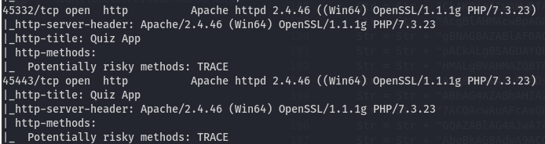

## Initial Enumeration

As always, we begin with a comprehensive `nmap` service and version scan to identify all open ports and running services:

```bash
nmap -sCV -T4 -p- -Pn $IP -oN enu/nmap-services.md
```

This yielded a significant amount of information. Below is a summarized version of the results:


### Notable Services Identified

- **SMB**
- **MySQL**
- **Multiple HTTP Instances**
- **FTP**
- **RPC**

The script scan results for the HTTP service indicated that the target is running **Windows OS**, which is also evident from the SMB and RPC ports being open:


---

### FTP Enumeration

The FTP service was found running on a non-standard port: **30021**. An attempt to log in anonymously was successful:


Despite access, browsing through the files didn’t reveal anything of immediate interest.

---

### SMB & RPC Enumeration

Tried using a null session to enumerate SMB and RPC, but both returned access denied errors. This suggests tighter restrictions on unauthenticated access.

---

### HTTP Enumeration

Navigating to the HTTP server running on port **8000** presented a **Barracuda dashboard** prompting the creation of an admin user:


Visiting the "About" page revealed the **Barracuda version number**:


Searching on Exploit-DB, a known vulnerability associated with this version was discovered. This could later be used for privilege escalation:


---

## Initial Foothold

Further enumeration of the web application revealed access to a **Web File Server**:


Unexpectedly, this interface appeared to provide access to the **entire file system**:


Initially, I considered uploading a Lua reverse shell, but remembered from the `nmap` results that additional HTTP servers were running **Apache**. If we could locate the Apache configuration files, we could identify the web root and possibly upload a PHP reverse shell.



Eventually, the Apache configuration was located:

  


PHP was confirmed, and the **htdocs** directory was found:


I uploaded [Ivan Sincek's PHP reverse shell](https://github.com/ivan-sincek/php-reverse-shell/blob/master/src/reverse/php_reverse_shell.php):


Set up a listener:


Triggered the shell:


Shell received:


---

## Privilege Escalation

Rather than starting full manual enumeration, I revisited the **Barracuda exploit** previously found on Exploit-DB:


I began by checking running services to see if the system was configured similarly:

```bash
wmic service get name,displayname,pathname,startmode
```


This confirmed the presence of the vulnerable service.

Next, I checked file and folder permissions:


Our user had write access to `bd.exe`, and `SeShutdownPrivilege` was enabled.

I renamed the original binary to `bd.exe.bak`:


Generated a reverse shell payload with `msfvenom`:


Uploaded the payload via `certutil`:

  


Scheduled a reboot using `shutdown /r`:


Listener waiting:


Received reverse shell as SYSTEM:


