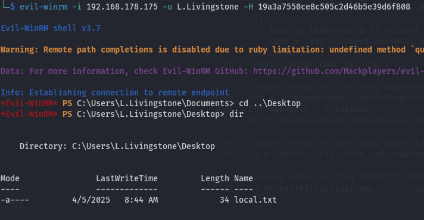

## 1. Overview

This assessment simulated an internal threat actor compromising a Windows Active Directory environment through credential abuse and privilege escalation via misconfigured Active Directory permissions. The attacker escalated privileges from a domain user to full control over the Domain Controller.

📌 This lab is part of OffSec’s Proving Grounds Practice platform and is not part of any exam content.

---

## 2. Initial Enumeration

### 🔍 Nmap Scan

Performed a port scan to identify exposed services on the target.

Notable Identified services:

- SMB  
- RPC  
- LDAP  
- WinRM

---

## 3. SMB Enumeration

Tested anonymous SMB login — no shares were available.

Used `rpcclient` to enumerate user RIDs and descriptions.

Discovered user account `V.Ventz` with a description that hinted at a password.

---

## 4. Gaining Initial Access

Checked this password with crackmapexec and found some readable shares:

Enumerated available shares and identified sensitive files on the "Password Audit" share.

---

## 5. Dumping Credentials

Downloaded `ntds.dit` and `SYSTEM` files from the share and extracted all domain user hashes.

  

Extracted accounts included `Administrator`, `L.Livingstone`, and others.

I tested pass-the-hash through crackmapexec on all of these and found another with a valid hash:

---

## 6. Remote Access via Evil-WinRM

While I wasn't able to crack any of the hashes, remembering that winrm was discovered in our initial scan, I logged into the target using the `L.Livingstone` NTLM hash via WinRM.

⚠️ I tried a lot of manual enumeration and uploading tools, but the Evil-WinRM was extremely unresponsive so I moved to offline enumeration with BloodHound.

---

## 7. Offline AD Enumeration via BloodHound

Used `bloodhound-python` with the NTLM hash to collect Active Directory data externally.

Loaded data into BloodHound and analyzed relationships.

  

BloodHound confirmed that the user `L.Livingstone` had `GenericAll` rights on the `RESOURCEDC` computer object, allowing us to configure delegation and impersonate a Domain Admin.

I tried PowerView via my Evil-WinRM shell for further enumeration, but winrm wouldn't stay stable long enough to upload anything. So after some research on the GenericAll privileges, I found this article about Impackets Addcomputer tool on [0xBEN](https://notes.benheater.com/books/active-directory/page/impacket-addcomputer)

---

## 8. Privilege Escalation via RBCD

### 8.1 Create a Machine Account

Used current access to create a new computer account in the domain.

  

Verified on the WinRM shell:

### 8.2 Delegate to the DC

I found a script that manages delegation rights and lets us set `msDS-AllowedToActOnBehalfOfOtherIdentity` [tothi](https://raw.githubusercontent.com/tothi/rbcd-attack/master/rbcd.py)

---

## 9. Domain Admin via Ticket Forging

### 9.1 Get Administrator TGT

We used `getST.py` to request a service ticket (TGS) as `Administrator`, allowing us to impersonate that user using the forged Kerberos ticket.

### 9.2 Use the Ticket

Used the forged TGT to obtain a SYSTEM shell on the Domain Controller.

🎉 Full compromise of the `resourced.local` domain achieved.

---

## 10. Lessons Learned

- User descriptions can leak sensitive credentials.  
- Readable shares exposing `ntds.dit` and `SYSTEM` provide a full credential dump.  
- `GenericAll` on a DC object enables full domain compromise via RBCD.  
- Offline BloodHound recon is a powerful tool when remote shells are unstable.
